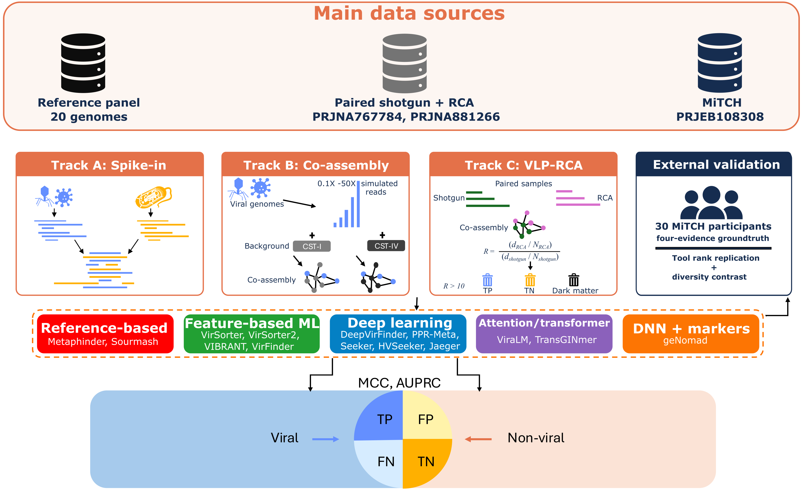

# Benchmarking virus identification tools on vaginal metagenomes



Code, derived data, figures, tables and Supplementary Information for the
manuscript by Dube, Happel, Jaspan and Warchavchik Hugerth.

We benchmarked 14 virus identification tools from five methodological
approaches on vaginal metagenomes, in four evaluations plus an independent
30-sample cohort for external validation. geNomad ranked first or second in
all four evaluations, the tool ranking replicated between cohorts
(Spearman ρ = 0.952), and Jaeger recovered 41 of 48 candidate viral dark-matter
contigs, compared with one for geNomad. The manuscript recommends geNomad for
high-confidence identification, VIBRANT where false-positive phage calls must
be minimised, and ViraLM or Jaeger as sensitive complements for discovery.

| Evaluation | Scored on | Main code |
|---|---|---|
| Track A | Controlled genome fragments (500–10,000 bp) | `scripts/05_spike_in`, `scripts/07_evaluation/benchmark_fragments.py` |
| Track B | Simulated viral reads co-assembled into vaginal metagenomes | `scripts/05_spike_in`, `scripts/09_expansion`, `scripts/07_evaluation/benchmark_track_b.py` |
| Multi-evidence | Real shotgun assemblies, labelled by several lines of evidence | `scripts/04_ground_truth`, `scripts/07_evaluation/pooled_multievidence_benchmark.py` |
| Track C | Virus-like-particle (RCA)-enriched co-assemblies | `scripts/03_assembly`, `scripts/07_evaluation/track_c_*.py` |
| MiTCH | Independent 30-sample cohort (external validation) | `scripts/08_mgcst/mitch`, `scripts/10_vmgc_crosscheck` |

Tool versions, settings, thresholds and references: Table S21 of the Supplementary Information.

## Repository layout

```
scripts/
  figures.R                            every R figure, one section per figure
  functions.R                          shared plotting theme and helpers
  tables/                              builders for Tables 1–2, S37, S38 and the supplementary workbook
  build_supplementary_information.py   builds the SI (markdown -> docx + pdf)
  03_assembly/        Track C co-assembly, enrichment and evaluation
  04_ground_truth/    evidence lines and tiered ground truth for the real shotgun assemblies
  05_spike_in/        Track A fragments, Track B read simulation and assembly, ANI-novel panel discovery
  06_tool_execution/  runs the 14 tools (CPU and GPU); wrappers/ for HVSeeker and TransGINmer
  07_evaluation/      parsing, scoring, statistics, sensitivity analyses, table publishing
  08_mgcst/           VIRGO2/VISTA/VALENCIA community state type assignment
  09_expansion/       Track B background cohorts and Track A novel-panel expansion
  10_vmgc_crosscheck/ VMGC cross-check and the MiTCH external validation
results/
  figures/            main and supplementary figures (PNG); archive/ holds the retired Graphviz Fig. 1
  tables/             Tables 1–2 and S1–S41 (.tsv), supplementary_tables.xlsx
    templates/        fixed row order and author-written text for four tables
  supplementary/      Supplementary_Information.{pdf,docx,md}: Supplementary Methods,
                      Figures S1–S22, Table legends S1–S41
  (other folders)     derived results read by the figure and table builders (no sequences)
docs/
  supplementary_methods.md    SI source text
  figure_table_captions.md    supplementary figure and table legends (SI source)
containers/           definitions for the four GPU tools; containers.tsv lists every tool's image
data/                 small inputs: fragment manifests, cohort run lists, Track B labels, novel-panel strata
config/               paths.example.sh — every site-specific path and account the scripts need
envs/                 R and Python environments used for the published outputs
```

## Reproducing the figures, tables and Supplementary Information

These steps use only files in this repository. Run them from the repository root.

```bash
# R figures (R 4.3.3; see envs/r-figures.yml)
Rscript scripts/figures.R                    # all R figures -> results/figures
Rscript scripts/figures.R --only fig_s1      # a single figure

# Python-built supplementary figures
python scripts/10_vmgc_crosscheck/05_plot_vmgc_overlap.py \
    --overlap-table results/tables/table_s24_vmgc_benchmark_overlap.tsv --out results/figures/fig_s11.png  # Fig. S11
python scripts/07_evaluation/viralm_investigation/06_plot_gt_construction.py     # Fig. S15
python scripts/07_evaluation/viralm_investigation/07_tier_evidence_breakdown.py  # Fig. S16

# Tables and workbook
python scripts/tables/build_table_s37.py
python scripts/tables/build_main_tables.py
python scripts/tables/build_supplementary_workbook.py

# Supplementary Information (pandoc 3.1.13, WeasyPrint)
python scripts/build_supplementary_information.py

# Regression tests for output parsing and metric display
python scripts/07_evaluation/test_viral_output_parsers.py
python scripts/07_evaluation/test_metric_display.py
python scripts/07_evaluation/test_benchmark_track_b.py
```

Table S38 needs the per-tool Track C outputs, which are not redistributed; its
published values are provided as a precomputed table.

## Regenerating the derived results from tool outputs

`scripts/07_evaluation/refresh_parser_revision.py` rebuilds the scored results and
the tables derived from them from saved tool outputs, in ten stages (Tables S16,
S17, S21, S24–S26, S33 and S36 are fixed inputs, not outputs of these stages):

```bash
for stage in tracka tracka_stats calibration primary trackb trackc rca mitch bootstrap publish; do
  python scripts/07_evaluation/refresh_parser_revision.py "$stage"
done
```

This requires the saved per-tool outputs (the stages read about 1 GB of them), which
are not redistributed because they include sequences from participant samples. No
classifier or assembly is re-run by these stages.

Before release this was checked end to end: every file the stages write was
deleted and the ten stages were re-run from the saved tool outputs. All 170
regenerated files were identical to the versions in this repository (two differ
only in an embedded timestamp), and the figures and tables rebuilt from them
matched the versions in this repository pixel for pixel and cell for cell.

**How tool outputs are scored.** A contig counts as positive when a tool reports
an accepted viral sequence spanning the contig or a region within it. Reported
sub-contig identifiers (geNomad `|provirus_…`, VIBRANT `_fragment_N`, VirSorter2
and VirSorter region suffixes) are mapped back to their parent contig, which is
scored once at its maximum score. VirSorter2 gives no score to short sequences
it reports with the suffix `||lt2gene` (fewer than two genes); these are scored
0, as in the analysis reported in the manuscript. VIBRANT (v1.0.1, container
image `multifractal/vibrant:0.5`)
is scored on its final accepted calls (`*.phages_combined.txt`), never on the
intermediate machine-learning table. The shared implementation is
`scripts/07_evaluation/viral_output_parsers.py`; where several completed VIBRANT
runs existed for an input, the run used is fixed by checksum in
`scripts/07_evaluation/vibrant_run_selection.tsv`.

## Running the upstream pipeline

The scripts under `scripts/` were written for a SLURM cluster with environment
modules and Apptainer/Singularity. To run them elsewhere:

1. `cp config/paths.example.sh config/paths.sh`, edit it, and `source config/paths.sh`.
   Scripts stop with a message naming any variable they need that is unset.
2. Submit with your own allocation: `sbatch` reads `SBATCH_ACCOUNT` and
   `SBATCH_PARTITION` from the environment; no account or partition is hard-coded.
   GPU jobs request `--gpus=1` (the published runs used NVIDIA L40S GPUs).
3. Reference databases go under `databases/` (see `scripts/04_ground_truth/download_databases.sh`
   and `scripts/06_tool_execution/setup_genomad.sh`).
4. Every tool's container image and version is listed in `containers/containers.tsv`
   (see `containers/README.md`). The nine CPU tools use public images;
   `scripts/06_tool_execution/pull_tool_images.sh` downloads them to
   `What_the_Phage/singularity_images/`, where `scripts/06_tool_execution/run_cpu_tools.sh`
   expects them. geNomad is pulled by `scripts/06_tool_execution/setup_genomad.sh`, and
   the four GPU tools are built from the definitions in `containers/`. Only HVSeeker and
   TransGINmer need wrappers (`scripts/06_tool_execution/wrappers/`).

Read preprocessing (adapter/quality trimming with fastp, human read removal
with Bowtie2 against hg19, and metaSPAdes assembly) was run with a Nextflow
pipeline that will be added to this repository in a later release; the
equivalent steps for Track B and the expansion cohorts are in
`scripts/05_spike_in` and `scripts/09_expansion`.

## Data availability

- Raw UChoose sequencing data: NCBI SRA PRJNA767784 (shotgun metagenomes) and
  PRJNA881266 (RCA-enriched viromes).
- Track B diversity backgrounds: PRJNA1054643, PRJNA1356845 and PRJNA1288683.
- MiTCH: 19 of the 30 samples are in ENA under PRJEB108308; the remaining 11 are
  available on request.
- **Not included here:** sequence data of any kind (reads, assemblies, genome
  fragments, spike-in genomes), per-tool raw outputs, and third-party reference
  databases. The ANI-novel panel genomes were assembled from MiTCH samples and
  are available on request; the repository carries only their short identifiers
  and derived results (`data/novel_spike_discovery/full_scale/novel_genome_strata.tsv`).
  The spike-in and negative-control genomes can be re-created with
  `scripts/05_spike_in/download_spike_in_genomes.sh`: NCBI accessions are
  downloaded directly, and four IMG/VR v5 (MetaVR) genomes are extracted from the
  MetaVR FASTA fetched by `scripts/04_ground_truth/download_databases.sh`.

## Licence and citation

Code is released under the MIT licence (`LICENSE`). Figures, tables and the
Supplementary Information in `results/figures/`, `results/tables/` and
`results/supplementary/` are released under the Creative Commons
Attribution 4.0 licence (CC BY 4.0, https://creativecommons.org/licenses/by/4.0/).
Citation information is in `CITATION.cff`.
